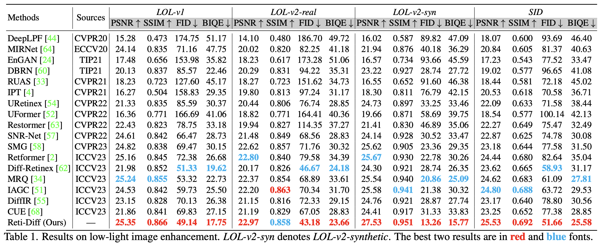
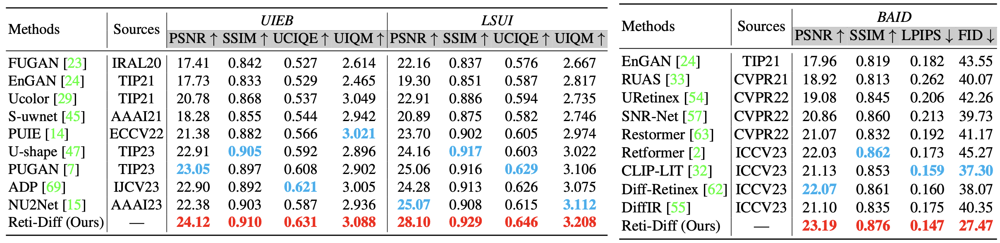
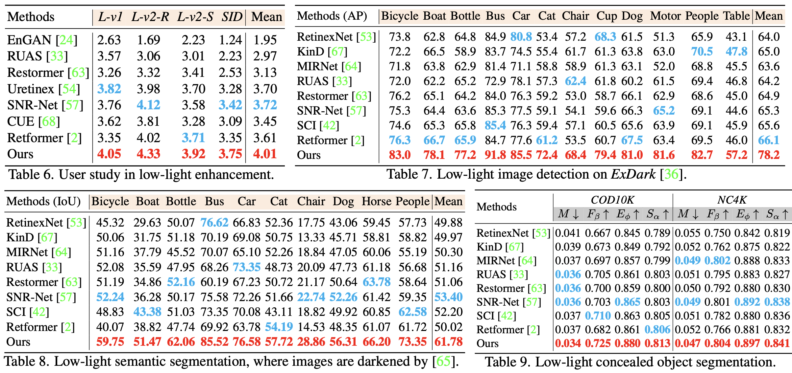
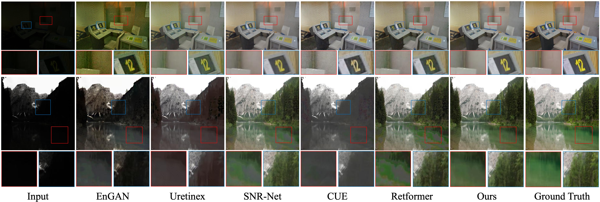
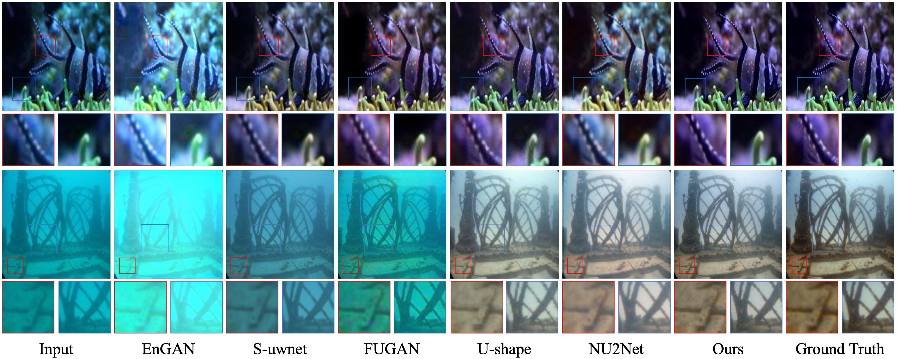
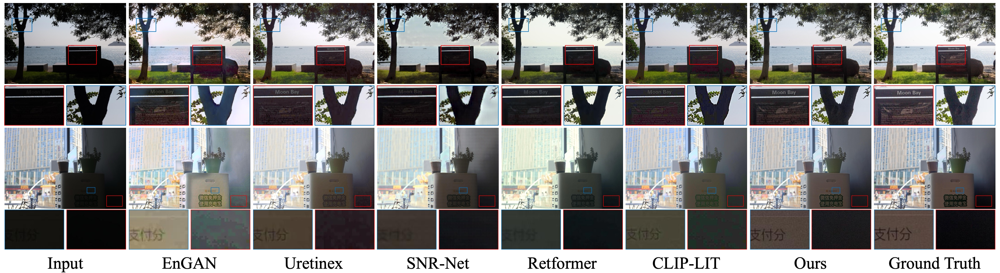

# UPT-Flow: Multi-Scale Transformer-Guided Normalizing Flow for Low-Light Image Enhancement

This is the official PyTorch code for the paper "UPT-Flow: A Multi-Scale Transformer-Guided Normalizing Flow for Low-Light Image Enhancement". The paper has been submitted for review.

#### 🔥🔥🔥 

> **Abstract:** Low-light images often suffer from information loss and RGB value degradation due to extremely low or nonuniform lighting conditions. Many existing methods primarily focus on optimizing the appearance distance between the enhanced image and the ground truth, while neglecting the explicit modeling of information loss regions or incorrect information points in low-light images. To address this, this paper proposes an RGB value Unbalanced Points-guided multi-scale Transformer-based conditional normalizing Flow (UPT-Flow) for low-light image enhancement. We design an unbalanced point map prior based on the differences in the proportion of RGB values for each pixel in the image, which is used to modify traditional self-attention and mitigate the negative effects of areas with information distortion in the attention calculation. The Multi-Scale Transformer (MSFormer) is composed of several global-local transformer blocks, which encode rich global contextual information and local fine-grained details for conditional normalizing flow. In the invertible network of flow, we design cross-coupling conditional affine layers based on channel and spatial attention, enhancing the expressive power of a single flow step. Without bells and whistles, extensive experiments on low-light image enhancement, night traffic monitoring enhancement, low-light object detection, and nighttime image segmentation have demonstrated that our proposed method achieves state-of-the-art performance across a variety of real-world scenes. 

## 🔗 Contents

- [x] Datasets
- [ ] Training
- [x] Testing
- [x] [Results](https://github.com/ChunmingHe/Reti-Diff/blob/main/README.md#-results)
- [x] [Acknowledgements](https://github.com/ChunmingHe/Reti-Diff/blob/main/README.md#-acknowledgements)

## 🔍 Datasets

1、LOLv2(real&synthetic): Wenhan Yang, Haofeng Huang, Wenjing Wang, Shiqi Wang, and Jiaying Liu. "Sparse Gradient Regularized Deep Retinex Network for Robust Low-Light Image Enhancement", TIP, 2021. [[Baiduyun (extracted code: l9xm)]](https://pan.baidu.com/s/1U9ePTfeLlnEbr5dtI1tm5g) [[Google Drive]](https://drive.google.com/file/d/1dzuLCk9_gE2bFF222n3-7GVUlSVHpMYC/view?usp=sharing)    

2、 MIT-Adobe FiveK: Please refer to [MBPNet(TIP2023)](https://github.com/kbzhang0505/MBPNet)

3、SMID and SDSD(indoor&outdorr): Please refer to [SNRNet(CVPR2022)](https://github.com/dvlab-research/SNR-Aware-Low-Light-Enhance)

## 🔍 Testing

## 🔍 Results

We achieved state-of-the-art performance on *low-light image enhancement*, *night traffic monitoring enhancement*, *low-light object detection* and "Nighttime semantic segmentation". More results can be found in the paper.

Quantitative Comparison (click to expan)

- Results in Table 1 of the main paper
  

  
	

- Results in Table 2-3 of the main paper
  

  
	

- Results in Table 6-9 of the main paper
  

  
	

  

Visual Comparison (click to expan)

- Results in Figure 3 of the main paper
  

  
	

- Results in Figure 4 of the main paper
  

  
	

- Results in Figure 5 of the main paper
  

  
	

  

## 🔍 Concat

If you have any questions, please feel free to contact me via email at lintao_xu@163.com.

## 💡 Acknowledgements
The codes are based on [LLFlow](https://github.com/wyf0912/LLFlow), [Restormer](https://github.com/swz30/Restormer), and [Uformer](https://github.com/ZhendongWang6/Uformer). Please also follow their licenses. Thanks for their awesome works.

